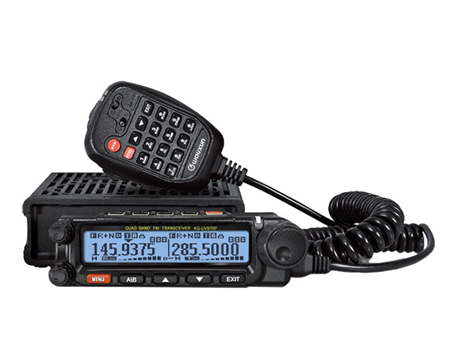
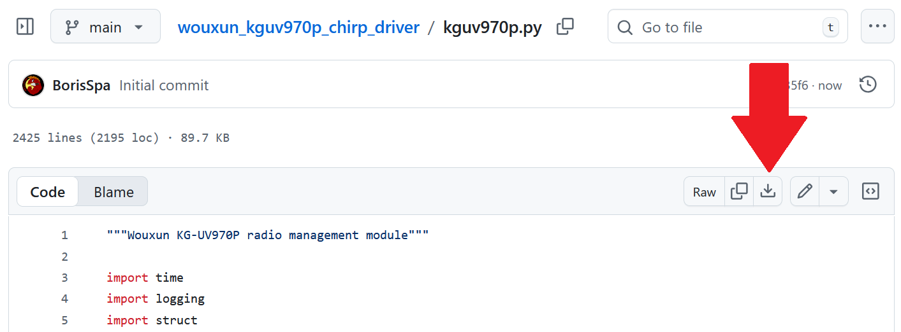
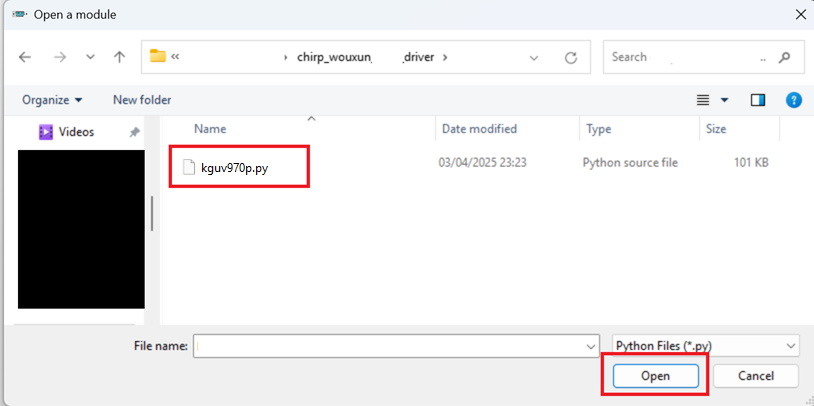
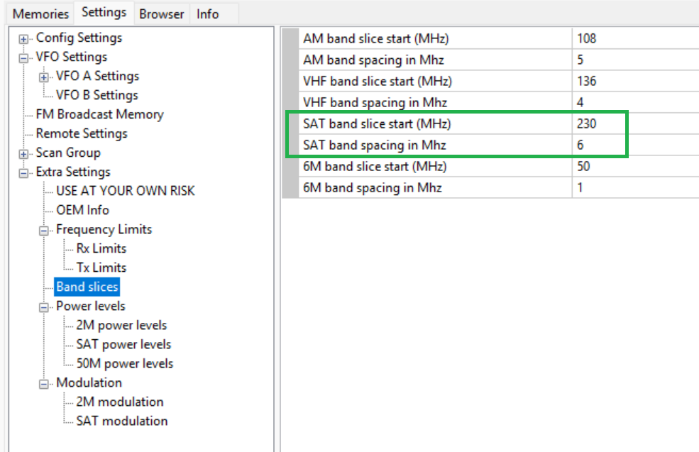
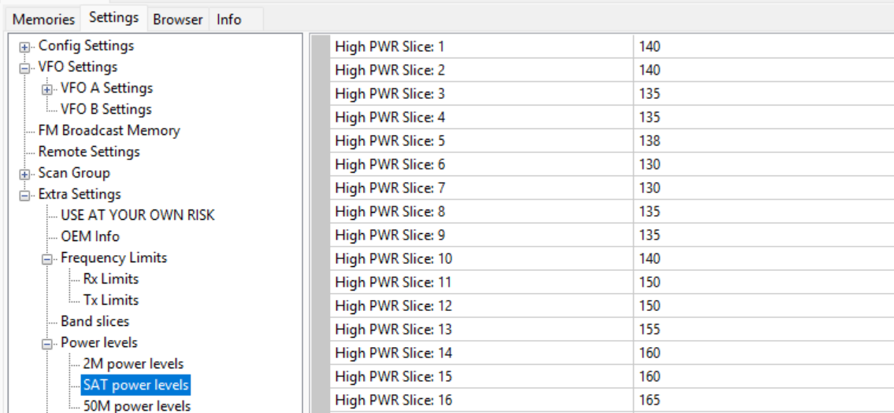

# Chirp driver for the Wouxun KG-M70

This repo consists of a chirp driver for controlling the Wouxun KG-UV970P radio

----

To run it, please follow this instructions:

1 - Make sure you have a **recent** version Chirp. You can download the latest version from its [official site](https://chirpmyradio.com/projects/chirp/wiki/Download#)

2 - Download the kg-uv970p driver from [here](https://github.com/SatcomRadio/wouxun_kguv970p_chirp_driver/blob/main/kguv970p.py)

You need to press this button to download the file

3 - Open Chirp and enable developer mode

4 - Press ok on the warning and **restart** Chirp. Close the program and open it again

5 - Open the option `File->Load Module`. If this option does not appear, make sure that you've enabled developer mode and **restart** Chirp

6 - Select the driver file you've downloaded in step #2

7 - Select the option `Radio->Download from radio` to read the radio configuration

8 - As the driver is now loaded, the KG-UV970P model should be displayed in the dropdown

9 - Make a backup of your file by going to `File->Save As` and save it as `OriginalFW.img`

9 - You can now edit advanced features of the radio such as RX, modulation, bands and power levels.

10 - Once you are happy with the results go again to `File->Save As` and save it as `ModdedFW.img`

11 - You can now write the changes to the radio by going to `Radio->Upload to radio`

-----

## Band slices

Modulation, power levels and RX adjustments are based on band slices.  
Power and modulation values go **from 0 (minimum) to 255 (maximum)**

You can define band slices at this menu

Let's say that you define the `SAT band slice` start at `230Mhz` and with a spacing of `6`

Then at the power levels, each slice would be this equivalent at Mhz

- Slice 1 -> <=230Mhz + 6 * 0 = **230Mhz**
- Slice 2 -> 230Mhz + 6 * 1 = **236Mhz**
- Slice 3 -> 230Mhz + 6 * 2 = **242Mhz**
- Slice 4 -> 230Mhz + 6 * 3 = **248Mhz**
- Slice 5 -> 230Mhz + 6 * 4 = **254Mhz**
- Slice 6 -> 230Mhz + 6 * 5 = **260Mhz**
- Slice 7 -> 230Mhz + 6 * 6 = **266Mhz**
- Slice 8 -> 230Mhz + 6 * 7 = **272Mhz**
- Slice 9 -> 230Mhz + 6 * 8 = **278Mhz**
- Slice 10 -> 230Mhz + 6 * 9 = **284Mhz**
- Slice 11 -> 230Mhz + 6 * 10 = **290Mhz**
- Slice 12 -> 230Mhz + 6 * 11 = **296Mhz**
- Slice 13 -> 230Mhz + 6 * 12 = **302Mhz**
- Slice 14 -> 230Mhz + 6 * 13 = **308Mhz**
- Slice 15 -> 230Mhz + 6 * 14 = **314Mhz**
- Slice 16 -> >=230Mhz + 6 * 15 = **320Mhz**

-----

In case you need an original firmware, you can download the original .img files that my radio uses.
